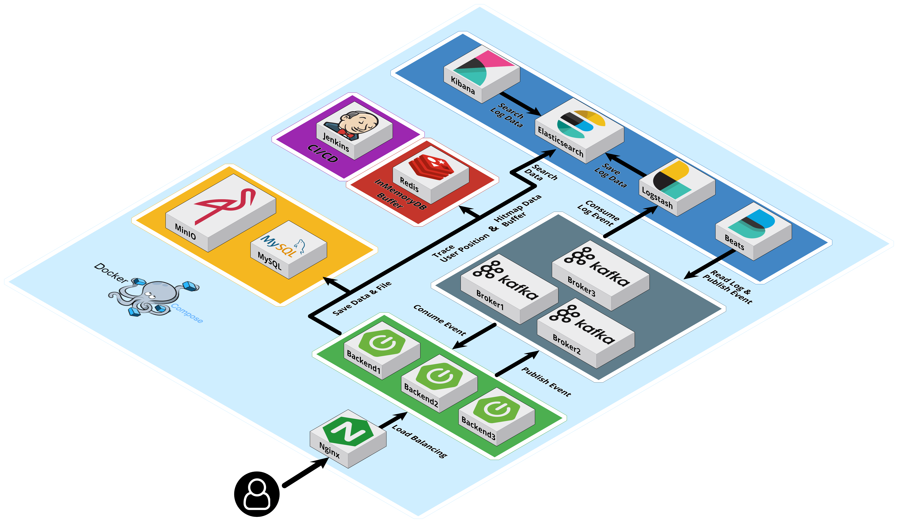

# Mungple Backend

## [프로젝트 소개 링크](https://github.com/Mungple)

## [프론트엔드 레포지토리 링크](https://github.com/Mungple/Mungple-Frontend)

## 1. Introduction (프로젝트 소개)

Mungple 프로젝트는 강아지 산책 시 실시간으로 위험, 정보 마커를 통해 정보를 공유하는 서비스입니다.

백엔드 프로젝트는 실시간 위치 기반 서비스를 제공하며, 대규모 데이터를 효율적으로 처리할 수 있도록 설계되었습니다.

### 주요 기능:
- 사용자 위치 기반 실시간 마커, (블루,레드)존 조회
- 실시간 사용자 위치 추적, 기록

---

## 2. Tech Stack (기술 스택)
**Backend**: SpringBoot, WebSocket

**DevOps**: Docker, Jenkins, Logback, Kibana

**Messaging**: Kafka

**Storage**: MinIO, MySQL, Elasticsearch, Redis

---

## 3. Architecture (아키텍처)
### 시스템 구성

### 주요 모듈:
- **Spring Boot**: 전체 백엔드 시스템의 중심으로, RESTful API 서버를 제공하여 클라이언트 요청을 처리하고, 데이터베이스와의 통신을 담당.
- **Kafka**: Event-Driven Architecture의 핵심으로, 비동기 메시지 처리를 통해 서비스 간 이벤트를 전달하고, 데이터 스트리밍을 관리.
- **Redis**: 사용자 위치 및 마커 데이터를 캐싱하여 빠른 조회 성능을 제공. 여러 Storage간의 정합성, 일관성 제공을 위해 사용.
- **Elasticsearch**: 위치 기반 검색을 위한 엔진으로, GeoHash 기능을 사용해 실시간으로 사용자 근처의 마커를 검색하고 제공.
- **STOMP Socket**: 실시간 데이터 업데이트를 위해 WebSocket을 기반으로 한 STOMP 프로토콜을 사용. 클라이언트와 서버 간의 양방향 통신을 지원하여 실시간 데이터 조회, 동기화를 제공.

---

## 5. Core Features
### 1. **분산 트랜잭션**
- 마커 등록 시 MinIO에 이미지를 저장하고, MySQL에 데이터를 삽입하며, Elasticsearch에 좌표 정보를 저장하는 과정에서 발생하는 트랜잭션을 관리합니다.
- **아웃박스 패턴**을 적용하여 MySQL에 이벤트를 저장하고, Kafka를 통해 이벤트를 비동기적으로 처리함으로써 데이터 일관성을 보장합니다.
- Elasticsearch 또는 MinIO에서 오류가 발생할 경우, 이전 **보상트랜잭션**을 통해 데이터 일관성을 유지합니다.

### 2. **분할 정복**
- 대규모 데이터 요청 및 처리 시, **Divide and Conquer(분할 정복)** 패턴을 사용하여 데이터를 작은 단위로 나누어 병렬 처리합니다.
- 사용자 위치 기반으로 블루존, 레드존 데이터를 요청할 때, 지정된 반경 내에서 Redis를 버퍼로 사용해 데이터를 효율적으로 분배하고 처리하여 성능을 최적화합니다.

### 3. **ELK 모니터링**
- **Elasticsearch**, **Logstash**, **Kibana**를 이용해 서비스 로그 및 시스템 상태를 실시간으로 모니터링합니다.
- 시스템 내 이벤트나 에러 로그를 시각화하여 문제 발생 시 신속하게 대응할 수 있도록 지원합니다.

### 4. **Redis**
- 사용자 이동 정보를 Redis에 캐시하여 실시간 데이터를 빠르게 처리하고, 조회 성능을 최적화합니다.
- Redis의 TTL(Time To Live)을 활용해 데이터의 유효 기간을 관리하고, 불필요한 캐시 메모리 점유를 방지합니다.
